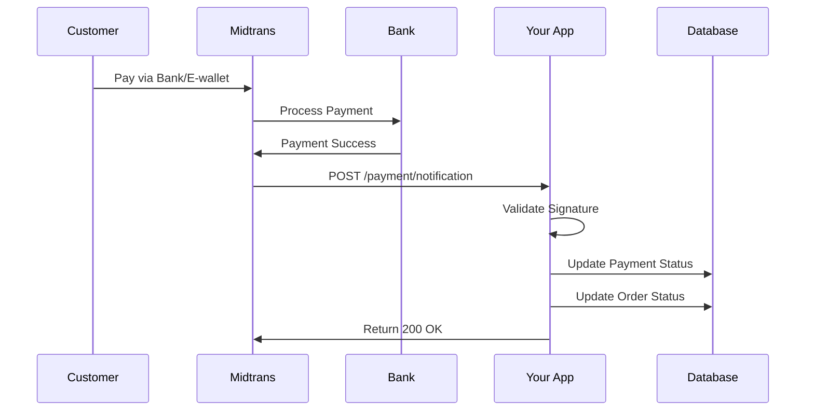

# Midtrans Payment Flow Documentation

## Overview
Implementasi payment gateway menggunakan Midtrans Snap untuk berbagai metode pembayaran (credit card, bank transfer, e-wallet, dll).

## Payment Flow

### 1. **Checkout Process** (`CheckoutRepository::placeOrder`)

#### Step 1: Create Order
```php
Order::create([
    'customer_id' => $customerId,
    'order_number' => 'INV20251113...',
    'status' => 'pending',
    'subtotal' => 100000,
    'shipping_cost' => 25000,
    'shipping_total' => 25000,
    'grand_total' => 125000,
    'customer_name' => 'John Doe',
    'customer_email' => 'john@example.com',
    'customer_phone' => '081234567890',
    'billing_address_id' => 1,
    'shipping_address_id' => 1,
    'billing_address_snapshot' => '{"recipient_name":"..."}',
    'shipping_address_snapshot' => '{"recipient_name":"..."}',
    'shipping_courier' => 'JNE',
    'shipping_service' => 'REG',
    'shipping_etd' => '2-4',
    'weight_total_gram' => 1000,
    'placed_at' => now(),
    'source' => 'web',
])
```

#### Step 2: Create Order Items
```php
OrderItem::create([
    'order_id' => $order->id,
    'purchasable_type' => Product::class,
    'purchasable_id' => 1,
    'sku' => 'PROD-001',
    'name' => 'Product Name',
    'quantity' => 2,
    'price' => 50000,
    'subtotal' => 100000,
    'weight_gram' => 500,
])
```

#### Step 3: Create Payment Record
```php
Payment::create([
    'order_id' => $order->id,
    'customer_id' => $customerId,
    'gross_amount' => 125000,
    'currency' => 'IDR',
    'transaction_status' => 'pending',
    'provider' => 'midtrans', // or 'manual', 'cod'
    'order_id_ref' => 'INV20251113...', // Same as order_number
    'transaction_time' => now(),
])
```

**Note:** Other fields (va_numbers, bank, masked_card, etc.) will be filled when Midtrans sends notification.

#### Step 4: Generate Midtrans Snap Token
```php
$snapToken = MidtransService::createSnapToken($order, $payment);
```

#### Step 5: Return Response
```php
return [
    'success' => true,
    'order_number' => 'INV20251113...',
    'snap_token' => 'xxx-xxx-xxx',
    'redirect_url' => '/checkout/thankyou/INV20251113...',
]
```

### 2. **Frontend Payment** (`checkout.blade.php`)

#### Step 1: Submit Form
```javascript
fetch('/checkout', {method: 'POST', body: formData})
```

#### Step 2: Open Midtrans Snap
```javascript
window.snap.pay(snap_token, {
    onSuccess: function(result) {
        // Redirect to thank you page
        window.location.href = redirect_url;
    },
    onPending: function(result) {
        // Redirect to thank you page
        window.location.href = redirect_url;
    },
    onError: function(result) {
        // Show error
        toast('error', 'Payment failed');
    },
    onClose: function() {
        // User closed popup
        window.location.href = redirect_url;
    }
})
```

### 3. **Midtrans Webhook** (`PaymentController::notification`)

**CRITICAL:** Webhook route **MUST NOT** use authentication middleware!

```php
// ✅ CORRECT
Route::post('/payment/notification', 'notification')->name('payment.notification');

// ❌ WRONG
Route::post('/payment/notification', 'notification')
    ->middleware(['auth:customer']) // This will block Midtrans webhook!
    ->name('payment.notification');
```

#### Webhook URL Configuration
**Sandbox:** `https://yourdomain.com/payment/notification`  
**Production:** `https://yourdomain.com/payment/notification`

Configure in Midtrans Dashboard:
1. Login to Midtrans Dashboard
2. Go to Settings → Configuration
3. Set **Payment Notification URL** to webhook URL above
4. Save configuration

#### Webhook Process Flow



#### Step 1: Receive Notification
```php
public function notification(Request $request)
{
    $notificationData = $request->all();
    $result = $this->midtrans->handleNotification($notificationData);
    return response()->json(['success' => true]);
}
```

#### Step 2: Validate Signature (`MidtransService::handleNotification`)
```php
$serverKey = config('services.midtrans.server_key');
$orderId = $notification->order_id;
$statusCode = $notification->status_code;
$grossAmount = $notification->gross_amount;
$signatureKey = $notification->signature_key;

$calculatedSignature = hash('sha512', $orderId.$statusCode.$grossAmount.$serverKey);

if ($signatureKey !== $calculatedSignature) {
    throw new \RuntimeException('Invalid signature key');
}
```

#### Step 3: Update Payment Record
```php
$payment->update([
    'midtrans_transaction_id' => $transactionId,
    'transaction_status' => $transactionStatus, // 'pending', 'settlement', 'capture', etc.
    'payment_type' => $paymentType, // 'bank_transfer', 'credit_card', 'gopay', etc.
    'fraud_status' => $fraudStatus,
    'transaction_time' => now(),
    'settlement_time' => now(), // Only for 'settlement' status
    'expiry_time' => $expiryTime, // If available
    'signature_key' => $signatureKey,
    'va_numbers' => [...], // If bank transfer
    'bank' => 'bca', // Bank code
    'permata_va_number' => '1234567890', // If Permata
    'bill_key' => 'xxxxx', // If convenience store
    'biller_code' => 'xxxxx', // If convenience store
    'masked_card' => '411111-1111', // If credit card
    'store' => 'indomaret', // If convenience store
    'actions' => [...], // Payment action links from Midtrans
    'raw_response' => $notificationData, // Full notification data
])
```

#### Step 4: Update Order Status
```php
// Map transaction_status to order status
$orderStatus = match($transactionStatus) {
    'settlement' => 'processing',
    'capture' => $fraudStatus === 'accept' ? 'processing' : 'pending',
    'pending' => 'pending',
    'deny', 'expire', 'cancel' => 'cancelled',
    default => null,
};

$order->update([
    'status' => $orderStatus,
    'paid_at' => now(), // Only for successful payment
    // OR
    'cancelled_at' => now(), // Only for failed payment
])
```

#### Step 5: Log Transaction
```php
PaymentLog::create([
    'payment_id' => $payment->id,
    'status' => $transactionStatus,
    'message' => "Midtrans notification: {$transactionStatus}",
    'payload' => $notificationData,
])
```

## Transaction Status Mapping

| Midtrans Status | Order Status | Payment Status | Description |
|----------------|--------------|----------------|-------------|
| `pending` | `pending` | `pending` | Payment awaiting customer action |
| `capture` | `processing` (if fraud=accept)<br>`pending` (if fraud=challenge) | `capture` | Credit card captured |
| `settlement` | `processing` | `settlement` | Payment successful & settled |
| `deny` | `cancelled` | `deny` | Payment denied by bank |
| `cancel` | `cancelled` | `cancel` | Payment cancelled by customer |
| `expire` | `cancelled` | `expire` | Payment expired (not completed in time) |

## Payment Methods & Codes

### Bank Transfer
- `transaction_status`: `pending` → `settlement`
- `payment_type`: `bank_transfer`
- `va_numbers`: Array of VA numbers
- Example: `[{"bank":"bca","va_number":"12345678901"}]`

### Credit Card
- `transaction_status`: `capture` → `settlement`
- `payment_type`: `credit_card`
- `masked_card`: `411111-1111`
- `fraud_status`: `accept`, `challenge`, or `deny`

### E-Wallet (GoPay, ShopeePay, etc)
- `transaction_status`: `pending` → `settlement`
- `payment_type`: `gopay`, `shopeepay`, etc.

### Convenience Store
- `transaction_status`: `pending` → `settlement`
- `payment_type`: `cstore`
- `store`: `indomaret`, `alfamart`
- `bill_key`: Payment code
- `biller_code`: Store code

## Database Schema

### Orders Table
```sql
id, customer_id, order_number, 
customer_name, customer_email, customer_phone,
billing_address_id, billing_address_snapshot,
shipping_address_id, shipping_address_snapshot,
subtotal, shipping_cost, shipping_total, discount_total, tax_total, grand_total,
shipping_courier, shipping_service, shipping_etd, weight_total_gram,
status, placed_at, paid_at, cancelled_at, 
source, notes
```

### Payments Table
```sql
id, order_id, customer_id, 
provider, midtrans_transaction_id, order_id_ref,
transaction_status, payment_type, fraud_status,
gross_amount, currency,
transaction_time, settlement_time, expiry_time,
va_numbers, permata_va_number, bill_key, biller_code,
masked_card, bank, store,
signature_key, actions, raw_response,
refund_amount, refunded_at
```

**Field Details:**
- `provider`: 'midtrans', 'manual', 'cod'
- `order_id_ref`: Order number for Midtrans callback lookup
- `transaction_status`: 'pending', 'settlement', 'capture', 'deny', 'cancel', 'expire'
- `payment_type`: 'bank_transfer', 'credit_card', 'gopay', 'shopeepay', 'cstore', etc.
- `fraud_status`: 'accept', 'challenge', 'deny'
- `transaction_time`: When transaction initiated at Midtrans
- `settlement_time`: When payment successfully settled
- `expiry_time`: When payment will expire (for pending payments)
- `va_numbers`: JSON array of virtual account numbers
- `permata_va_number`: Specific VA for Permata bank
- `bill_key` + `biller_code`: Payment code for convenience stores
- `masked_card`: Masked credit card number (e.g., "411111-1111")
- `bank`: Bank code (e.g., "bca", "bni", "mandiri")
- `store`: Store name for convenience store payments
- `signature_key`: Midtrans signature for validation
- `actions`: JSON array of payment actions/links from Midtrans
- `raw_response`: Full JSON response from Midtrans notification

### Payment Logs Table
```sql
id, payment_id, order_id,
type, headers, payload, ip_address, occurred_at
```

**Field Details:**
- `type`: 'payment_created', 'midtrans_notification', 'status_update', etc.
- `headers`: JSON of HTTP request headers
- `payload`: JSON with detailed information about the event
- `ip_address`: IP address of the request
- `occurred_at`: When the event occurred

## Testing Webhook Locally

### 1. Use ngrok to expose local server
```bash
ngrok http 8000
```

### 2. Update Midtrans Dashboard with ngrok URL
```
https://abc123.ngrok.io/payment/notification
```

### 3. Test Payment
1. Create order via checkout
2. Pay using Midtrans test credentials
3. Check logs: `tail -f storage/logs/laravel.log`
4. Verify payment and order status in database

### 4. Check Payment Status Manually (Command)
```bash
# Interactive mode - will ask for confirmation
php artisan midtrans:check-status {order_number}

# Auto-update mode - no confirmation needed
php artisan midtrans:check-status {order_number} --update

# Example
php artisan midtrans:check-status INV2025111309133307UT --update
```

**Command will:**
- Query Midtrans API for current payment status
- Display payment details in a table
- Ask if you want to update local database (or auto-update with `--update` flag)
- Simulate webhook notification and update payment + order status
- Show success message with updated statuses

### 5. Manual Webhook Testing
```bash
# Simulate Midtrans webhook
curl -X POST http://localhost:8000/payment/notification \
  -H "Content-Type: application/json" \
  -d '{
    "transaction_time": "2025-11-13 10:00:00",
    "transaction_status": "settlement",
    "transaction_id": "test-123",
    "status_message": "Success",
    "status_code": "200",
    "signature_key": "...",
    "payment_type": "bank_transfer",
    "order_id": "INV20251113...",
    "merchant_id": "G123456789",
    "gross_amount": "125000.00",
    "fraud_status": "accept",
    "currency": "IDR"
  }'
```

## Common Issues & Solutions

### Issue 1: Payment status not updating
**Cause:** Webhook route has authentication middleware  
**Solution:** Remove auth middleware from notification route

### Issue 2: Invalid signature error
**Cause:** Wrong server key or calculation  
**Solution:** Verify server key in `.env` matches Midtrans dashboard

### Issue 3: Webhook not received
**Cause:** Firewall blocking Midtrans IP  
**Solution:** Whitelist Midtrans IPs in your server

### Issue 4: Database not updating
**Cause:** Exception thrown in webhook handler  
**Solution:** Check logs at `storage/logs/laravel.log`

### Issue 5: Payment logs show wrong status
**Cause:** Not handling all transaction statuses  
**Solution:** Check `determineOrderStatus()` method

## Configuration

### Environment Variables (.env)
```env
# Midtrans Configuration
MIDTRANS_SERVER_KEY=your-server-key-here
MIDTRANS_CLIENT_KEY=your-client-key-here
MIDTRANS_IS_PRODUCTION=false
MIDTRANS_IS_SANITIZED=true
MIDTRANS_IS_3DS=true
```

### Config File (config/services.php)
```php
'midtrans' => [
    'server_key' => env('MIDTRANS_SERVER_KEY'),
    'client_key' => env('MIDTRANS_CLIENT_KEY'),
    'is_production' => env('MIDTRANS_IS_PRODUCTION', false),
    'is_sanitized' => env('MIDTRANS_IS_SANITIZED', true),
    'is_3ds' => env('MIDTRANS_IS_3DS', true),
],
```

## Monitoring & Debugging

### Check Payment Status
```php
// In tinker or controller
$payment = Payment::where('order_id_ref', 'INV20251113...')->first();
echo "Status: " . $payment->transaction_status;
echo "Updated: " . $payment->updated_at;
```

### Check Order Status
```php
$order = Order::where('order_number', 'INV20251113...')->first();
echo "Status: " . $order->status;
echo "Paid At: " . $order->paid_at;
```

### Check Payment Logs
```php
$payment = Payment::where('order_id_ref', 'INV20251113...')->first();
$logs = $payment->logs()->latest()->take(5)->get();
foreach ($logs as $log) {
    echo "{$log->created_at}: {$log->status} - {$log->message}\n";
}
```

### Enable Debug Logs
```php
// In MidtransService::handleNotification
\Log::info('Midtrans notification received', [
    'order_id' => $orderId,
    'transaction_status' => $transactionStatus,
    'payment_type' => $paymentType,
    'raw_data' => $notificationData,
]);
```

## Security Best Practices

1. ✅ **Always validate signature** in webhook handler
2. ✅ **Use HTTPS** in production
3. ✅ **No authentication** on webhook route (Midtrans can't auth)
4. ✅ **Log all transactions** for audit trail
5. ✅ **Whitelist Midtrans IPs** (optional but recommended)
6. ✅ **Use environment variables** for sensitive keys
7. ✅ **Enable 3DS** for credit card transactions

## Support & Resources

- **Midtrans Docs:** https://docs.midtrans.com
- **Notification Docs:** https://docs.midtrans.com/en/after-payment/http-notification
- **Testing:** https://docs.midtrans.com/en/technical-reference/sandbox-test
- **Dashboard:** https://dashboard.midtrans.com (sandbox) / https://dashboard.midtrans.com (production)

---

**Last Updated:** November 13, 2025  
**Status:** ✅ Production Ready - Webhook properly configured
